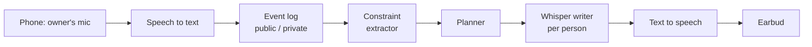

# Plus One: Team Plan

2026-09-19 · @Someone

## Concept

Plus One is a voice agent for group planning: a group talks out loud as usual, and the AI whispers to each person separately through one earbud. Nobody hears anyone else's whispers.

Each person can whisper back their real constraints (budget, dates they can't do, people they'd rather avoid). The AI uses all of them to steer the group toward a plan that works, without ever saying who needed what.

**Pitch line:** plan the trip everyone can actually afford, without anyone having to say it.

**Why it isn't a chat UI:** there is no chat on screen. Two people at the same table hear different things from the same agent, and the only thing the group sees is a counter of how many people have shared constraints.

## Sponsor fit

Meta is the main target and the build should be shaped for it first. The other sponsors ride along on the same build.

| Sponsor | How we fit | What we have to do |
| --- | --- | --- |
| Meta | Friends plan honestly together; the AI is essential because it holds private constraints from some people while acting for all | Use Muse Spark and Muse Voice Transcribe; submit a working prototype, a 2-3 minute demo video, a public repo, and a short write-up (who it's for, how it strengthens connection, why AI is essential) |
| Linq | Plus One lives in iMessage: a private thread per person for whispers and one group thread for the plan | Read the track's prize and judging rules; get an API key and a number early; use group chats, typing indicators, and voice memos on purpose |
| The Token Company | Long multi-person sessions get expensive | Compress context, route cheap steps to a small model, and log tokens per run with and without it for a before/after number |
| SpaceXAI | Build in Cursor; Grok Voice speaks the whispers | Must use Cursor and the Grok Imagine or Voice API; confirm with them that a space theme isn't required |
| Devin | A bounded piece of the build | Give it one self-contained job (dashboard or tests) and show that clearly in the demo |

Meta judges on how much the project strengthens human connection, how essential and well-integrated the AI is, originality, and the working demo. The privacy boundary is our originality claim, so protect time for it.

## How it works

Three jobs: listen, think, speak. Every phone hears only its owner, and every message carries a public or private tag.



Read left to right: speech becomes tagged events, private events become structured constraints, and the planner's output becomes a short spoken whisper for each person.

1. **Listening.** Each phone transcribes only its owner, so we never have to work out who said what from one shared microphone. Normal talking is public. Holding a whisper button makes that utterance private to the AI.
2. **Thinking.** A cheap model turns private whispers into constraints (budget cap, date block, person to avoid, energy level, hard or soft). The planner scores candidate plans against everyone's constraints and decides whether a nudge would help right now.
3. **Speaking.** A per-person model writes a one- or two-sentence whisper, and streamed text to speech plays it in that person's earbud. Occasionally the AI speaks to the whole table through a laptop speaker, but only about things that are safe to say publicly.

**Stack (keep it boring):** a Python FastAPI or Node websocket server, in-memory state or SQLite for replay, and a plain web page per phone with a whisper button and audio playback. All logic lives on the server.

## Channels: iMessage and voice

Plus One runs on two channels over one brain. iMessage through Linq is the everyday channel, and earbud audio is the in-person one. Both feed the same event log, constraints, and `context_for` boundary, so the privacy guarantee doesn't depend on the channel.

- **Private thread per person.** Each person texts Plus One one-on-one. This is the whisper channel: they send real constraints there and get nudges back.
- **One group thread.** Plus One sits in the group chat with everyone and posts the plan and public suggestions. It never quotes a private thread.
- **No install.** People just text a number, which removes the phone-page HTTPS and mic problems and makes joining one step.
- **Voice.** In person, the same whispers play through one earbud as speech, and voice memos can carry them over iMessage.

Linq is an API for sending and receiving iMessage, RCS, and SMS, with webhooks, group chats, typing indicators, and voice memos ([Linq](https://linqapp.com/imessage-api)). Use those features on purpose, for example a typing indicator while the agent works out a plan.

**Leak surface.** Private threads and the group thread are now separate channels, so the leak test must include extraction attempts through the group thread, not only private ones.

**Unknowns.** We haven't seen the Linq track's prize or judging rules, and we don't yet know how fast we can get an API key and a number at the event.

## Privacy boundary

The guarantee lives in one function, `context_for(viewer)`, not in a prompt. No model ever receives anything that function didn't build.

Every message is an event in an append-only log:

```json
{ "id": 41, "ts": 1758300000, "speaker": "sam",
  "visibility": "private:sam", "text": "I can't do more than 150 this month" }
```

| Output | What the model is given |
| --- | --- |
| Whisper to person U | The public log, U's own private events, and an anonymous group summary (for example "budget ceiling is about $150") |
| Public speech to the table | The public log and the same anonymous summary; never raw private events |

Because whispers only see the anonymous summary, a whisper to Sam can never say "Priya can't afford this."

**Inference leaks.** Even without quoting anyone, a plan that gets cheaper the moment one person joins points at that person. Keep plans varied, and never let a change trace back to a single speaker.

**When to whisper.** Only when the current public proposal conflicts with that person's private constraints, they aren't mid-sentence, and about 20 seconds have passed since their last whisper. Keep whispers to two sentences.

**Proof for the demo.** Invite the audience to try to extract someone's secret through the AI, and show a counter of attempts versus leaks. Run a scripted batch of extraction attempts beforehand so we have a real number to quote.

## Build order

Build the text version end to end first, then swap in voice. Every step should leave a working demo behind it.

1. Two people texting Plus One through Linq (a private thread each, plus one group thread), with messages tagged public or private in the event log. If Linq access is slow, use a bare web page instead.
2. `context_for` plus the constraint extractor, tested with a few hand-written cases.
3. Whisper generation, delivered as an iMessage in each person's private thread. This is the fallback demo if audio is flaky.
4. Speech to text for input and text to speech for output.
5. Whisper timing rules, then the attempts-versus-leaks counter.
6. Polish, the demo video, and the write-up.

**First hour:** test the voice APIs for streaming and multi-session behavior, and measure latency. Aim for under 3 seconds from end of speech to the start of a whisper. If it's much slower, stay on iMessage only and decide early.

**Cut order if we run short:** the earbud audio first, then whisper timing polish, then the Token Company compression, then the live audience extraction (keep the pre-run leak number). Do not cut the privacy boundary or the iMessage loop.

## Roles

This assumes a team of 3-4, and we are three, so the work splits into three streams. Each is buildable alone against a shared contract, so each person's coding agent can work without waiting on the others. Names are blank until we assign them.

| Stream | Owns | Talks to the others via | Works alone by |
| --- | --- | --- | --- |
| A: Core | Websocket server, rooms, event log, `context_for`, Linq adapter (webhooks in, messages out), routing whispers to the right thread or phone, replay, repo, HTTPS tunnel | Calls B's functions; sends and receives Linq and client messages | Stubbing B with hardcoded whispers |
| B: Brain | Constraint extractor, plan scoring, anonymous group summary, whisper writer, timing rules, leak-test harness (private and group threads), token logging | Plain functions that take and return dicts | Running on fixture groups from a test script, no server |
| C: Voice and client | Earbud audio (speech to text, text to speech), audio phone page, counter screen, demo video, and a bare text page as a fallback if Linq access is slow | Websocket messages only | Using a fake server that replies with canned whispers |

### Contracts

Agree these in the first 30 minutes, then freeze them in a `contracts/` folder. Changing one afterwards needs all three of us to agree.

- **Event:** `{id, ts, speaker, visibility: "public" | "private:<user>", text}`
- **Constraint:** `{user, type: budget_cap | date_block | avoid_person | energy, value, hard: true | false}`
- **B's functions:** `extract_constraints(event)` returns constraints; `group_summary(constraints)` returns an anonymous string; `write_whisper(viewer_context)` returns text; `should_whisper(state)` returns true or false
- **Client to server:** `{type: "utterance", visibility, text}`
- **Server to client:** `{type: "whisper", text}`, `{type: "public", speaker, text}`, `{type: "counter", shared, total}`

**Linq mapping (stream A).** An inbound message in a person's one-on-one thread becomes an event with `visibility: private:<user>`. An inbound message in the group thread becomes a public event. A whisper is sent to that person's one-on-one thread, and public suggestions go to the group thread.

### Repo layout

`/contracts`, `/server` (A), `/brain` (B), `/client` (C), `/fixtures` (sample groups and canned whispers). Each person's coding agent works only inside its own folder. Put a short AGENTS.md or Cursor rules file at each folder root that states the scope and lists the contract files it must not edit.

### Integration points

1. **First 30 minutes:** contracts frozen. B writes three fixture groups, C writes canned whispers, A writes the empty server skeleton.
2. **Text loop:** A swaps its stub for the real brain, and C swaps the fake server for the real one. Done when two phones can send typed messages and get a whisper on screen.
3. **Voice:** C plugs speech to text and text to speech into the working loop.
4. **Leak counter:** B's harness runs against A's real server, and C shows the result on screen.

Good self-contained jobs to hand to Devin: B's leak-test harness, or C's counter screen.

## Demo script

The demo runs about 2-3 minutes, which also fits Meta's video length. Use real people, not scripted ones.

1. **Setup (15 seconds).** Four people at a table, each with a phone and one earbud. A screen shows only the room name and a counter of how many people have shared constraints.
2. **The problem (20 seconds).** The group starts planning a weekend trip out loud and drifts toward an expensive option.
3. **The whispers (45 seconds).** Two people quietly whisper conflicting limits to their phones. The AI whispers different nudges to each, then says one thing to the whole table that fits everyone. Show that the counter moved but no one's numbers appeared.
4. **The attack (45 seconds).** Invite a judge to try to pull someone's secret out of the AI. The attempts-versus-leaks counter ticks up while the leak count stays at zero.
5. **Close (15 seconds).** State the pitch line and who it's for: friend groups who avoid saying what they actually can't do.

**Fallback:** if audio fails on stage, run the same script with whispers as iMessages in each private thread, and say so.

## Checklist and open questions

Several of these are unverified and should be checked in the first hour, because they decide what we can build.

**To verify early**

- [ ] What are the Linq track's prize and judging rules, and how many teams are on it?
- [ ] How fast can we get a Linq API key and a phone number at the event?
- [ ] Do we have enough iPhones (team plus demo volunteers) for blue-bubble group threads, or do the RCS and SMS fallbacks cover it?
- [ ] Do Muse Voice Transcribe and Grok Voice support streaming, and how do they handle several simultaneous sessions?
- [ ] Is a space theme required for the SpaceXAI challenge, or only Cursor plus a Grok API?
- [ ] Does Meta's Official Rules text limit submitting one project to several sponsors?
- [ ] What is the submission deadline?
- [ ] Has someone already shipped a shared, privacy-aware multi-person agent? Spend ten minutes searching before we commit.
- [ ] Is the "Plus One" name and a matching domain or repo name free?

**Submission**

- [ ] Working prototype
- [ ] 2-3 minute demo video
- [ ] Public code repository
- [ ] Short write-up: who it's for, how it strengthens connection, why AI is essential
- [ ] Token counts logged with and without compression
- [ ] Extraction-attempt results recorded (attempts versus leaks)
